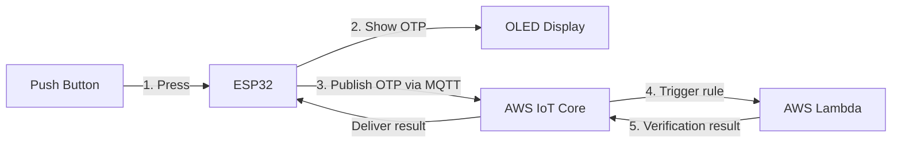

# MFA Physical Token Simulator

A hardware-in-software demonstration of multi-factor authentication: a simulated ESP32 device generates a one-time password (OTP) on button press, displays it on an OLED screen, and an AWS Lambda function independently verifies it over MQTT — mirroring how a physical hardware token (like an RSA SecurID fob) works end to end.

Built entirely in simulation using [Wokwi](https://wokwi.com) — no physical hardware required, though the same firmware runs unmodified on a real ESP32.

## How it works



1. Pressing the button generates a random 6-digit OTP on the ESP32.
2. The OTP is shown on the OLED with a 30-second validity countdown.
3. The ESP32 publishes `{deviceId, otp, timestamp}` to AWS IoT Core over MQTT (TLS, mutual certificate auth).
4. An IoT Core rule triggers a Lambda function on every message to the `mfa/otp` topic.
5. Lambda checks the OTP is well-formed and from a known device, then publishes a `{verified, reason}` result to `mfa/result`.
6. The ESP32 receives the result and shows **VERIFIED** or **REJECTED** on the OLED.

## Project structure

```
.
├── src/
│   ├── main.cpp        # Firmware: button, OTP generation, OLED, Wi-Fi, MQTT/TLS
│   └── secrets.h        # Wi-Fi + AWS credentials (gitignored — see Setup)
├── lambda/
│   └── lambda_function.py  # Cloud-side OTP verifier (deployed via AWS Lambda console)
├── diagram.json          # Wokwi simulated circuit (ESP32 + OLED + button)
├── wokwi.toml            # Wokwi simulator config
└── platformio.ini        # Build config and library dependencies
```

## Hardware / components simulated

| Component | Role |
|---|---|
| ESP32 DevKit | Core microcontroller — OTP generation, Wi-Fi, MQTT |
| Push button | Triggers OTP generation |
| SSD1306 OLED (I2C) | Displays the OTP, countdown, and verification result |
| AWS IoT Core | MQTT broker, mutual-TLS device authentication |
| AWS Lambda | Server-side OTP verification |

Pin mapping (also used if flashed to real hardware): OLED VCC→3V3, GND→GND, SDA→GPIO21, SCL→GPIO22. Button→GPIO4, other leg→GND.

## Setup

### 1. Run the simulation
1. Open this project in VS Code / Cursor with the **PlatformIO** and **Wokwi** extensions installed.
2. Create `src/secrets.h` (see below) with your own values — it's gitignored, so it won't be here after cloning.
3. `PlatformIO: Build`, then `Wokwi: Start Simulator`.

### 2. secrets.h
This file is gitignored since it holds AWS credentials. Create `src/secrets.h` with:
- `WIFI_SSID` / `WIFI_PASSWORD` — use `"Wokwi-GUEST"` / `""` for simulation
- `AWS_IOT_ENDPOINT` — from AWS IoT Core → Settings
- `THING_NAME` — must match the Thing name created in AWS IoT Core
- `AWS_CERT_CA`, `AWS_CERT_CRT`, `AWS_CERT_PRIVATE` — contents of your downloaded Amazon Root CA 1, device certificate, and private key

### 3. AWS setup
1. **IoT Core**: create a Thing, generate a certificate + private key, attach a policy allowing `iot:Connect`, `iot:Publish`, `iot:Subscribe`, `iot:Receive`.
2. **Lambda**: create a Python function, paste in `lambda/lambda_function.py`, deploy. Needs `iot:Publish` permission on its execution role.
3. **IoT Rule**: create a rule with SQL `SELECT * FROM 'mfa/otp'` that triggers the Lambda function.

## Notes on scope

This is a **conceptual demo**, not a production-grade authenticator:
- The OTP is a random 6-digit code, not a cryptographic TOTP/HOTP — Lambda validates structure and device identity rather than a shared secret.
- The device's `timestamp` field is `millis()` (time since boot), not wall-clock time, so it's informational only — freshness is implicitly guaranteed since MQTT delivery to Lambda is near-instant.

**Possible extensions:** real TOTP (RFC 6238) with a pre-shared secret and NTP-synced time; DynamoDB logging for replay protection; flashing to physical ESP32 hardware (pin mapping is already compatible).

## Author

Darshan Kumar — BTech CSE (AI & ML), SR University
